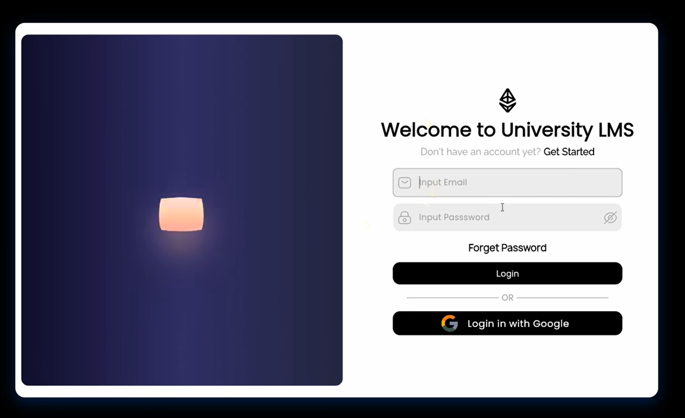

# 🔐 Flutter Firebase Web Authentication 

A complete, production-ready Firebase Authentication system built with Flutter, Riverpod, and GoRouter. Features real-time form validation, auth state persistence, and route guards.

## ScreenShots




## ✨ Features

- 🔑 **Email & Password Auth** — Signup, Login, Logout
- 🛡️ **Route Guards** — GoRouter redirect based on auth state
- ✅ **Real-time Validation** — Inline errors as you type
- 🔒 **Password Toggle** — Show/hide password
- 🍞 **Toast Notifications** — Success and error feedback
- 🎨 **ThemeData** — All colors from centralized theme
- 📦 **Clean Architecture** — Model, Service, Provider, UI separated
- 🐣 **Lottie Animations** — Polished loading states

---

## 🏗️ Architecture

```
lib/
  auth/
    data/
      model/
        auth_state.dart       # Immutable state with copyWith
    features/
      pages/
        login.dart            # Login screen
        signup.dart           # Signup screen
        homepage.dart         # Protected home screen
      providers/
        auth_form_provider.dart     # Separate providers per screen
        auth_method_provider.dart   # AuthMethod provider
      services/
        auth_method.dart      # Firebase Auth + Firestore CRUD
        auth_validator.dart   # StateNotifier with validators
  core/
    const/
      app_sizes.dart          # Centralized spacing constants
    theme/
      custom.dart             # ThemeData with ColorScheme
    widgets/
      custom_textfeild.dart   # Reusable TextField widget
  routers/
    custom_route.dart         # GoRouter with auth redirect guard
```

---

## 🔌 State Management

```dart
// Separate providers for login and signup screens
final authSignupNotify = StateNotifierProvider<AuthValidator, AuthState>(...);
final authLoginNotify  = StateNotifierProvider<AuthValidator, AuthState>(...);

// AuthState — immutable with copyWith + sentinel pattern
// Prevents null from being set accidentally
static const _auth = Object();
namerror: _auth == namerror ? this.namerror : namerror as String?
```

---

## 🛡️ Route Guard

```dart
// GoRouter redirect — auto redirects based on auth state
redirect: (context, state) {
  final user = FirebaseAuth.instance.currentUser;
  final isAuthRoute = path == "/login" || path == "/signup";

  if (user != null && isAuthRoute) return '/home';   // logged in → home
  if (user == null && !isAuthRoute) return '/login'; // not logged in → login
  return null;
}
```

---

## 🔒 Firestore Security Rules

```javascript
rules_version = '2';
service cloud.firestore {
  match /databases/{database}/documents {
    match /users/{userId} {
      allow read, write: if request.auth != null
                         && request.auth.uid == userId;
    }
  }
}
```

---

## 📦 Packages Used

| Package | Purpose |
|---|---|
| `firebase_auth` | Authentication |
| `cloud_firestore` | User data storage |
| `flutter_riverpod` | State management |
| `go_router` | Navigation + route guards |
| `toastification` | Toast notifications |
| `lottie` | Animations |
| `gap` | Clean spacing |
| `line_icons` | Icons |

---

## 🚀 Getting Started

```bash
git clone https://github.com/dartrox404/flutter-firebase-auth.git
flutter pub get
# Add your own firebase_options.dart via FlutterFire CLI
flutterfire configure
flutter run
```

> ⚠️ `firebase_options.dart` is in `.gitignore`. Run `flutterfire configure` to generate your own.

---

## 👨‍💻 Author

**Arslan Javed** — Flutter Developer  
📧 arslanjaved57420@gmail.com  
🔗 [LinkedIn](https://linkedin.com/in/arslan-javed-060aaa35b)  
🐙 [GitHub](https://github.com/dartrox404)

---

## 📄 License

MIT License
